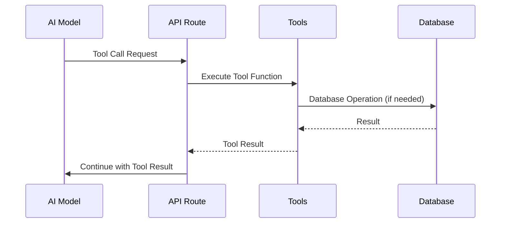
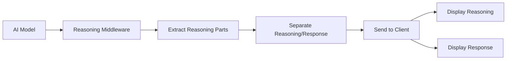
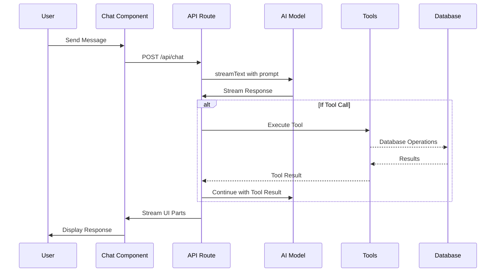

# AI Integration and Models Documentation

This document provides a comprehensive overview of the AI integration and models used in this chatbot application.

## 1. AI Providers and Model Configurations

The application uses multiple AI providers through the Vercel AI SDK:

### Primary Provider
- **OpenAI**: Using `gpt-5-nano` model for most operations
- **Fallback Models**: Configured for different purposes (title generation, artifact creation)

### Custom Provider Implementation
The application implements a custom provider in [`lib/ai/providers.ts`](file:///Users/mac/Repos/dev/ai-chatbot/lib/ai/providers.ts#L1-L46) that:
- Uses mock models in test environments
- Switches to real OpenAI models in production
- Implements specialized models for different functions

### Model Configuration
Defined in [`lib/ai/models.ts`](file:///Users/mac/Repos/dev/ai-chatbot/lib/ai/models.ts#L1-L5):
- `chat-model`: Primary model for conversations
- `chat-model-reasoning`: Specialized model with reasoning capabilities
- `title-model`: Dedicated model for generating conversation titles
- `artifact-model`: Model for artifact-related operations

## 2. Vercel AI SDK Integration

The application extensively uses the Vercel AI SDK for:

### Core Functionality
- **Streaming Responses**: Using `streamText` function in the chat API route [`app/(chat)/api/chat/route.ts`](file:///Users/mac/Repos/dev/ai-chatbot/app/(chat)/api/chat/route.ts#L1-L220)
- **Model Abstraction**: Through the `customProvider` implementation
- **Tool Integration**: With the `experimental_activeTools` configuration
- **Reasoning Capabilities**: Using middleware wrappers

### Key Integration Points
1. **Chat API Route**: Main endpoint for AI interactions
2. **Frontend Chat Component**: Uses `useChat` hook from `@ai-sdk/react`
3. **Model Selection**: Dynamic switching between different models based on context

## 3. Tool Calling Implementation

The application implements several AI tools in [`lib/ai/tools/`](file:///Users/mac/Repos/dev/ai-chatbot/lib/ai/tools/):

### Available Tools
1. **Document Creation** ([`createDocument`](file:///Users/mac/Repos/dev/ai-chatbot/lib/ai/tools/create-document.ts#L13-L42)): Allows the AI to create new documents
2. **Document Updates** ([`updateDocument`](file:///Users/mac/Repos/dev/ai-chatbot/lib/ai/tools/update-document.ts#L13-L44)): Enables modification of existing documents
3. **Suggestions** ([`requestSuggestions`](file:///Users/mac/Repos/dev/ai-chatbot/lib/ai/tools/request-suggestions.ts#L11-L35)): Provides contextual suggestions
4. **Weather Information** ([`getWeather`](file:///Users/mac/Repos/dev/ai-chatbot/lib/ai/tools/get-weather.ts#L7-L24)): Fetches weather data

### Tool Integration Flow

## 4. Prompt Engineering Strategies

Implemented in [`lib/ai/prompts.ts`](file:///Users/mac/Repos/dev/ai-chatbot/lib/ai/prompts.ts#L1-L43):

### System Prompts
- Different prompts for regular interactions and artifact creation
- Contextual information incorporated to guide AI responses

### Conditional Prompting
- Dynamic adjustment of prompts based on the selected model
- Special handling for reasoning-enabled models

### Prompt Structure
1. **Base Instructions**: Core behavior guidelines
2. **Contextual Information**: User-specific data and preferences
3. **Task-Specific Guidance**: Instructions for specific operations

## 5. Reasoning Capabilities

The application implements reasoning capabilities through:

### Specialized Reasoning Model
- Separate model configuration with reasoning middleware
- Uses `extractReasoningMiddleware` from Vercel AI SDK

### Implementation Details
- **Reasoning Tags**: Uses XML-style tags to separate reasoning from responses
- **Middleware Processing**: Extracts reasoning parts before delivering final response
- **UI Handling**: Frontend treats reasoning parts differently from regular text

### Reasoning Flow

## 6. Implementation Architecture

### Overall Flow

### Key Components
1. **Frontend**: React components using `useChat` hook
2. **API Layer**: Next.js API routes handling AI interactions
3. **AI Integration**: Vercel AI SDK with custom provider
4. **Tool System**: Extensible tool calling mechanism
5. **Database**: PostgreSQL with Drizzle ORM for persistence

This implementation provides a robust foundation for an AI-powered chatbot with tool calling capabilities, reasoning features, and extensible architecture.