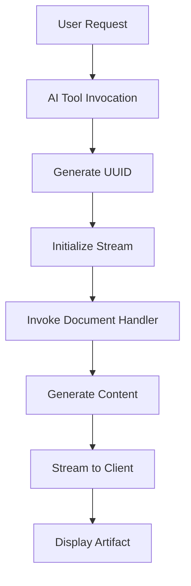
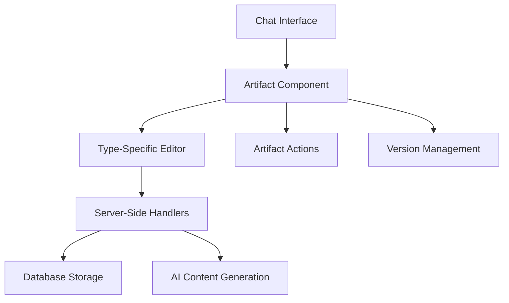

# Artifacts System in the Chatbot Application

The artifacts system in this chatbot application provides a powerful way to create, manage, and interact with various types of content generated during conversations. This system enhances the chatbot functionality by allowing users to work with documents, code, images, and spreadsheets directly within the chat interface.

## 1. Artifact Types

The system supports four main types of artifacts:

1. **Text Artifacts**: For creating and editing text content like essays, articles, and documentation
2. **Code Artifacts**: For generating and executing code snippets with integrated development environment features
3. **Image Artifacts**: For AI-generated images that can be created and manipulated
4. **Sheet Artifacts**: For working with spreadsheet data and performing data analysis

Each artifact type has its own specialized UI components and functionality tailored to the specific content type.

## 2. Artifact Components

The artifacts system uses several React components to display and manage artifacts:

### Core Components
- **Artifact** (`components/artifact.tsx`): The main container component that manages the artifact lifecycle, including versioning, saving, and UI state
- **CreateArtifact** (`components/create-artifact.tsx`): A class-based system for defining artifact types with their specific behaviors
- **ArtifactActions** (`components/artifact-actions.tsx`): Provides action buttons for interacting with artifacts (copy, version control, etc.)
- **ArtifactMessages** (`components/artifact-messages.tsx`): Displays chat messages related to the artifact

### Type-Specific Components
- **Text Artifacts**: Use `TextEditor` (`components/text-editor.tsx`) for content editing
- **Code Artifacts**: Use `CodeEditor` (`components/code-editor.tsx`) with integrated console for code execution
- **Image Artifacts**: Use `ImageEditor` (`components/image-editor.tsx`) for image display and manipulation
- **Sheet Artifacts**: Use `SpreadsheetEditor` (`components/sheet-editor.tsx`) for spreadsheet editing

### Supporting Components
- **Toolbar** (`components/toolbar.tsx`): Provides context-specific actions for each artifact type
- **VersionFooter** (`components/version-footer.tsx`): Shows version history and navigation controls
- **DiffView** (`components/diffview.tsx`): Displays differences between artifact versions

## 3. Artifact Creation

Artifacts are created through AI tools integrated into the chatbot:

### Process Flow
1. **AI Tool Invocation**: When a user requests content creation, an AI tool is invoked (e.g., `createDocument` in `lib/ai/tools/create-document.ts`)
2. **UUID Generation**: A unique identifier is generated for the new artifact
3. **Stream Initialization**: Data streams are initialized to send real-time updates to the client
4. **Content Generation**: The appropriate document handler generates content based on the artifact type
5. **UI Update**: The client receives streaming updates and displays the artifact in real-time

### Implementation Details


Each artifact type has its own server-side handler (e.g., `textDocumentHandler` in `artifacts/text/server.ts`) that defines how content is generated and updated.

## 4. Artifact Management

Artifacts are managed through a combination of client-side state management and server-side persistence:

### Client-Side Management
- **useArtifact Hook** (`hooks/use-artifact.ts`): Manages the current artifact state in the UI
- **SWR Data Fetching**: Uses SWR for efficient data fetching and caching of artifact metadata
- **Real-time Updates**: Receives streaming updates from the server as content is generated

### Server-Side Storage
- **Database Schema**: Artifacts are stored in the `Document` table with fields for ID, title, content, type, and user association
- **Versioning**: Each save creates a new record with a timestamp, enabling version history
- **API Routes**: RESTful endpoints (`/api/document`) handle CRUD operations for artifacts

### Data Structure
```typescript
interface UIArtifact {
  title: string;
  documentId: string;
  kind: 'text' | 'code' | 'image' | 'sheet';
  content: string;
  isVisible: boolean;
  status: 'streaming' | 'idle';
  boundingBox: {
    top: number;
    left: number;
    width: number;
    height: number;
  };
}
```

## 5. Artifact Editing

Users can interact with and edit artifacts through several mechanisms:

### Inline Editing
- **Text Artifacts**: Rich text editing with markdown support
- **Code Artifacts**: Syntax-highlighted code editor with language support
- **Sheet Artifacts**: Spreadsheet-style grid editing

### AI-Powered Editing
- **Refinement Requests**: Users can ask the AI to improve or modify existing artifacts
- **Contextual Suggestions**: AI can provide suggestions for improving content
- **Automated Formatting**: AI can format and structure content appropriately

### Version Control
- **History Tracking**: All changes are saved as new versions
- **Diff Viewing**: Users can compare versions to see changes
- **Version Navigation**: Users can move between different versions of an artifact

## 6. Artifact Versioning

The artifacts system includes comprehensive version control features:

### Implementation
- **Timestamp-based Versions**: Each save creates a new version with a timestamp
- **Database Structure**: The `Document` table uses a composite primary key (ID + createdAt) to support multiple versions
- **Version Navigation**: Users can move forward and backward through version history

### Features
- **Diff View**: Visual comparison between versions showing additions and deletions
- **Revert Functionality**: Ability to restore previous versions
- **Change Tracking**: Clear indication of what changed between versions

### UI Components
- **VersionFooter**: Shows version history and navigation controls
- **ArtifactActions**: Provides version control actions (view changes, previous/next version)
- **Toolbar**: Context-specific actions for the current artifact version

## System Architecture

The artifacts system follows a modular architecture:



This architecture allows for:
1. **Extensibility**: Easy addition of new artifact types
2. **Consistency**: Uniform handling of common operations across artifact types
3. **Performance**: Efficient data fetching and caching
4. **User Experience**: Real-time updates and responsive UI

The artifacts system significantly enhances the chatbot's functionality by providing users with powerful tools to create, edit, and manage various types of content directly within the conversation interface.