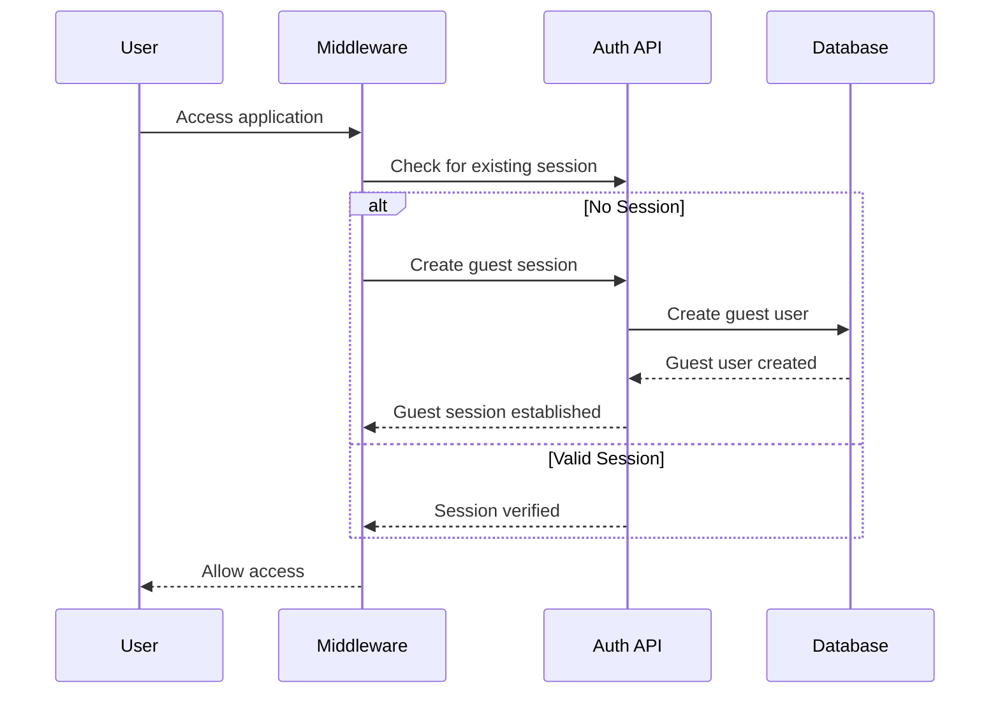
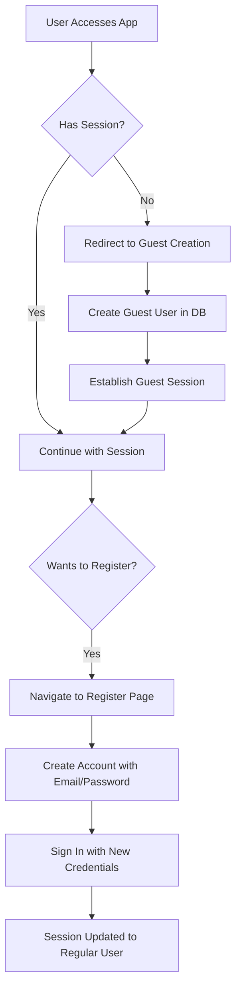

# Authentication and User Management System

This chatbot application implements a comprehensive authentication and user management system using Auth.js (NextAuth.js) with support for both guest access and traditional email/password registration. The system ensures user data isolation and security while providing a seamless user experience.

## 1. Authentication Providers

The application supports two primary authentication methods:

### Guest Access
- **Anonymous Access**: Users can immediately start using the application without creating an account
- **Automatic Provisioning**: Guest users are automatically created when accessing the application without a valid session
- **Limited Entitlements**: Guest users have restricted access (20 messages per day) compared to registered users (100 messages per day)

### Email/Password Authentication
- **Traditional Registration**: Users can create accounts with email and password
- **Secure Password Handling**: Passwords are hashed using bcrypt before storage
- **Session Management**: Registered users have persistent sessions with secure cookies

## 2. Auth.js (NextAuth.js) Implementation

The authentication system is implemented using NextAuth.js with a custom configuration:

### Core Configuration
- **File**: [`app/(auth)/auth.ts`](file:///Users/mac/Repos/dev/ai-chatbot/app/(auth)/auth.ts#L38-L92)
- **Providers**: 
  - Credentials provider for email/password authentication
  - Custom guest provider for anonymous access
- **Callbacks**: JWT and session callbacks to extend user data with user type information

### Session Structure
The session includes extended user information:
```typescript
interface Session {
  user: {
    id: string;
    type: 'guest' | 'regular';
  } & DefaultSession['user'];
}
```

### Authentication Flow


## 3. Session Management

### Middleware Protection
- **File**: [`middleware.ts`](file:///Users/mac/Repos/dev/ai-chatbot/middleware.ts#L5-L41)
- **Automatic Session Creation**: Users without sessions are automatically redirected to create a guest session
- **Route Protection**: API routes and pages are protected from unauthorized access
- **Session Validation**: Uses `getToken` to validate sessions with secure cookies

### Session Persistence
- **Secure Cookies**: Sessions are stored in HTTP-only, secure cookies
- **Environment-Specific Security**: Cookie security settings adapt to development/production environments
- **Session Refresh**: Client-side session updates are handled through React context

### Session Lifecycle
1. **Initialization**: Middleware checks for existing session on all protected routes
2. **Guest Creation**: If no session exists, user is redirected to guest creation endpoint
3. **Session Extension**: Registered users can extend their session through login
4. **Session Termination**: Users can sign out, which terminates their session and returns them to guest status

## 4. User Data Isolation

### Database-Level Isolation
- **User-Scoped Queries**: All database queries include user ID filters to ensure data isolation
- **Foreign Key Relationships**: Database schema enforces user ownership through foreign key constraints
- **Access Control**: API endpoints verify user ownership before allowing data operations

### Implementation Example
In the chat API route ([`app/(chat)/api/chat/route.ts`](file:///Users/mac/Repos/dev/ai-chatbot/app/(chat)/api/chat/route.ts#L88-L92)):
```typescript
const session = await auth();
if (!session?.user) {
  return new ChatSDKError('unauthorized:chat').toResponse();
}

// Ensure user owns the chat
if (chat.userId !== session.user.id) {
  return new ChatSDKError('forbidden:chat').toResponse();
}
```

### Data Access Patterns
- **User Ownership**: All data entities (chats, messages, documents) are linked to users via foreign keys
- **Query Scoping**: Database queries always filter by user ID to prevent data leakage
- **Permission Validation**: API endpoints validate user permissions before data operations

## 5. Guest User Flow

### Automatic Guest Creation
- **Seamless Onboarding**: Users can immediately start using the application without registration
- **Unique Guest IDs**: Guest users receive unique identifiers in the format `guest-{timestamp}`
- **Temporary Accounts**: Guest accounts are created with hashed dummy passwords for security

### Guest to Registered User Transition


### Guest User Limitations
- **Rate Limiting**: 20 messages per day
- **No Account Management**: Cannot change password or manage account settings
- **Data Retention**: Guest data may be purged periodically

## 6. Registration and Login Process

### Registration Flow
1. **Form Submission**: User provides email and password on [`/register`](file:///Users/mac/Repos/dev/ai-chatbot/app/(auth)/register/page.tsx#L54-L74) page
2. **Validation**: Server action validates input using Zod schema
3. **Duplicate Check**: System checks if email already exists
4. **User Creation**: New user is created with hashed password
5. **Session Establishment**: User is automatically signed in after registration

### Login Flow
1. **Form Submission**: User provides credentials on [`/login`](file:///Users/mac/Repos/dev/ai-chatbot/app/(auth)/login/page.tsx#L61-L73) page
2. **Credential Verification**: Credentials are verified against database
3. **Password Comparison**: Provided password is compared with stored hash
4. **Session Creation**: Valid credentials establish authenticated session

### Security Measures
- **Password Hashing**: bcrypt with salt rounds for secure password storage
- **Rate Limiting**: Message limits prevent abuse (20/day for guests, 100/day for registered users)
- **Input Validation**: Zod schema validation prevents malicious input
- **Secure Cookies**: HTTP-only, secure cookies for session storage
- **Error Obfuscation**: Generic error messages prevent information leakage

## 7. User Interface Integration

### Session-Aware Components
- **User Navigation**: [`components/sidebar-user-nav.tsx`](file:///Users/mac/Repos/dev/ai-chatbot/components/sidebar-user-nav.tsx#L26-L113) displays user status and authentication options
- **Conditional Rendering**: UI elements adapt based on user type (guest vs. registered)
- **Session Updates**: React context ensures UI reflects current authentication state

### Guest User Experience
- **Clear Identification**: Guest users see "Guest" instead of email in UI
- **Registration Prompts**: UI encourages guest users to create accounts
- **Seamless Transition**: Guest data persists during registration process

This authentication system provides a balance between accessibility and security, allowing users to immediately engage with the application while providing clear pathways to full account registration with enhanced privileges.