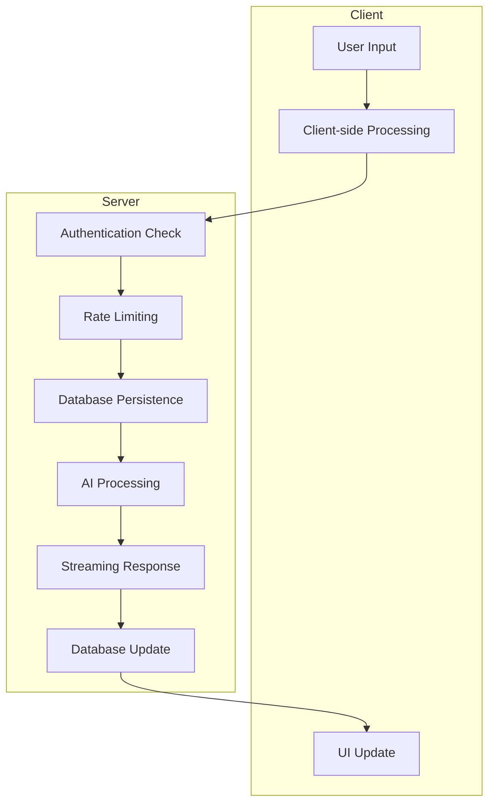

# Chat Functionality and API Endpoints Documentation

This document provides a comprehensive overview of the chat functionality in the AI Chatbot application, covering the UI components, API endpoints, message handling, streaming implementation, error handling, and chat history management.

## 1. Chat Interface

The chat interface is built using React components with Next.js App Router. The main components include:

### Core Components

1. **Chat Component** (`components/chat.tsx`):
   - Main chat container that orchestrates the entire chat experience
   - Uses the `useChat` hook from `@ai-sdk/react` for chat state management
   - Integrates with the `/api/chat` endpoint for message processing
   - Manages message input, submission, and display

2. **Messages Component** (`components/messages.tsx`):
   - Renders the conversation history
   - Displays both user and assistant messages
   - Handles message actions like voting and regeneration

3. **MultimodalInput Component** (`components/multimodal-input.tsx`):
   - Handles user input for text and file attachments
   - Provides a form interface for submitting messages
   - Integrates with the chat's send message functionality

4. **ChatHeader Component** (`components/chat-header.tsx`):
   - Displays chat metadata and controls
   - Provides navigation options and model selection

### Key Features

- **Real-time Streaming**: Messages are displayed as they're generated by the AI
- **Multi-turn Conversations**: Context-aware conversations with message history
- **Message Voting**: Ability to upvote/downvote messages for feedback collection
- **Responsive Design**: Mobile-friendly interface that works across devices
- **Model Selection**: Ability to choose between different AI models
- **Visibility Controls**: Options to make chats public or private

## 2. API Endpoints

The chat functionality is powered by several API endpoints:

### Main Chat Endpoint

**POST `/api/chat`** (`app/(chat)/api/chat/route.ts`):
- Processes user messages and generates AI responses
- Handles authentication and rate limiting
- Manages chat creation and message persistence
- Implements streaming responses using Server-Sent Events (SSE)

**DELETE `/api/chat`** (`app/(chat)/api/chat/route.ts`):
- Deletes a chat conversation and all associated data
- Requires authentication and ownership verification

### Streaming Endpoint

**GET `/api/chat/[id]/stream`** (`app/(chat)/api/chat/[id]/stream/route.ts`):
- Resumes interrupted streaming sessions
- Implements resumable streams using Redis
- Handles stream restoration for incomplete responses

### History Endpoint

**GET `/api/history`** (`app/(chat)/api/history/route.ts`):
- Retrieves paginated chat history for the authenticated user
- Supports pagination with `starting_after` and `ending_before` parameters
- Implements proper authentication and authorization checks

### Vote Endpoint

**GET/POST `/api/vote`** (`app/(chat)/api/vote/route.ts`):
- Retrieves and manages message votes
- Allows users to upvote or downvote messages
- Implements proper authentication and ownership checks

## 3. Message Handling

### Message Structure

Messages are stored in the database with the following structure:
- `id`: Unique identifier for the message
- `chatId`: Reference to the parent chat
- `role`: Either 'user' or 'assistant'
- `parts`: Array of message parts (text, files, etc.)
- `attachments`: File attachments associated with the message
- `createdAt`: Timestamp of message creation

### Processing Flow

1. **User Message Submission**:
   - User submits a message through the UI
   - Message is validated and saved to the database
   - Chat session is created if it doesn't exist

2. **AI Processing**:
   - User message is sent to the selected AI model via Vercel AI SDK
   - System prompt is constructed with context and user location
   - AI tools are made available for enhanced functionality

3. **Response Generation**:
   - AI response is streamed back to the client in real-time
   - Response is saved to the database upon completion
   - UI is updated as the response arrives

### Data Persistence

Messages are stored in a PostgreSQL database using Drizzle ORM:
- Messages are saved in the `Message_v2` table
- Each message is associated with a chat session
- Message parts support multiple content types (text, files, etc.)

## 4. Streaming Implementation

The application implements real-time streaming using Server-Sent Events (SSE):

### Stream Creation

1. When a user submits a message, a new stream is created
2. A unique `streamId` is generated and associated with the chat
3. The AI response is processed through `createUIMessageStream`
4. The stream is transformed to SSE format using `JsonToSseTransformStream`

### Resumable Streams

1. Stream context is managed globally with Redis support
2. If Redis is available, streams can be resumed after interruptions
3. The `/api/chat/[id]/stream` endpoint handles stream restoration
4. Incomplete responses can be restored based on timestamp comparison

### Client-Side Handling

1. The `useChat` hook manages the streaming state
2. Data parts are processed through the `onData` callback
3. The UI updates incrementally as data arrives
4. Stream completion is handled through the `onFinish` callback

## 5. Error Handling

The application implements a comprehensive error handling system:

### Error Types

1. **BadRequestError**: Invalid request parameters or data
2. **UnauthorizedError**: User not authenticated
3. **ForbiddenError**: User lacks permission for the requested resource
4. **NotFoundError**: Requested resource doesn't exist
5. **RateLimitError**: User has exceeded usage limits
6. **OfflineError**: Network connectivity issues

### Error Management

1. **ChatSDKError Class** (`lib/errors.ts`):
   - Custom error class that extends the built-in Error class
   - Provides structured error codes and messages
   - Handles different error surfaces (chat, auth, database, etc.)

2. **Error Response Format**:
   ```json
   {
     "code": "error_type:surface",
     "message": "Human-readable error message",
     "cause": "Additional context (optional)"
   }
   ```

3. **Client-Side Handling**:
   - Errors are caught in the `onError` callback of `useChat`
   - User-friendly error messages are displayed using toast notifications
   - Specific error handling for different error types

### Error Visibility

Errors are handled with different visibility levels:
- **Response**: Errors shown to the user
- **Log**: Errors logged server-side but not shown to user
- **None**: Errors suppressed

## 6. Chat History Management

### Storage and Retrieval

1. **Database Schema**:
   - Chats are stored in the `Chat` table with metadata
   - Messages are stored in the `Message_v2` table
   - Each chat is associated with a user

2. **Pagination**:
   - Chat history is retrieved in paginated chunks
   - Supports `starting_after` and `ending_before` parameters
   - Default page size of 20 chats

### UI Organization

1. **Grouping by Date**:
   - Today's chats
   - Yesterday's chats
   - Last 7 days
   - Last 30 days
   - Older than last month

2. **Infinite Scrolling**:
   - Automatically loads more chats as user scrolls
   - Visual indicator for loading state
   - End of history detection

### Chat Lifecycle

1. **Creation**:
   - Automatically created when user sends first message
   - Title generated from first user message
   - Visibility settings applied

2. **Modification**:
   - Messages added as conversation progresses
   - Visibility can be changed between public/private
   - Votes can be added to messages

3. **Deletion**:
   - Entire chat and associated data can be deleted
   - Requires user confirmation
   - Cascading deletion of messages, votes, and streams

## Data Flow Architecture



## Key Technologies

1. **Frontend**: Next.js 15 with App Router, React 19, TypeScript
2. **Backend**: Vercel AI SDK, PostgreSQL with Drizzle ORM
3. **Authentication**: Auth.js (NextAuth.js)
4. **Streaming**: Server-Sent Events with Redis for resumable streams
5. **UI Components**: Tailwind CSS, shadcn/ui
6. **State Management**: React state with SWR for data fetching

This architecture provides a robust, scalable chat experience with real-time streaming, proper error handling, and efficient data management.