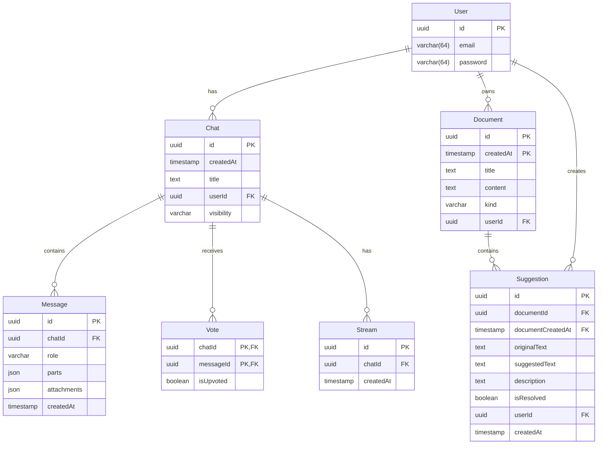

# Database Schema and Migrations in the Chatbot Application

## 1. Database Technology

The chatbot application uses **PostgreSQL** as its database system with **Drizzle ORM** as the Object-Relational Mapping tool:

- PostgreSQL is configured in `drizzle.config.ts` with `dialect: 'postgresql'`
- Dependencies include `@vercel/postgres`, `postgres`, and `drizzle-orm`
- The documentation explicitly mentions PostgreSQL as the database layer

## 2. Schema Design

The database schema consists of several interconnected tables that support the chatbot's functionality:

### Core Tables:

1. **User Table**: Stores user information including email and hashed password
2. **Chat Table**: Contains chat sessions with titles, creation timestamps, and user associations
3. **Message Table**: Stores individual messages with roles (user/assistant), content parts, and attachments
4. **Vote Table**: Tracks upvotes/downvotes on messages
5. **Document Table**: Stores documents created during chat sessions
6. **Suggestion Table**: Contains suggested edits to documents
7. **Stream Table**: Manages streaming connections for real-time communication

## 3. Drizzle ORM Implementation

The Drizzle ORM implementation is found in `lib/db/schema.ts` and follows these patterns:

- Tables are defined using Drizzle's `pgTable` function
- Column types are specified with appropriate constraints (primaryKey, notNull, default, etc.)
- Foreign key relationships are established using the `references` method
- Composite primary keys are defined using the `primaryKey` function in table configurations
- Type inference is achieved using `InferSelectModel` for TypeScript support

The ORM is used in the application through:
- Query functions in `lib/db/queries.ts` that use Drizzle's query builder
- Migration scripts that generate SQL from the schema definitions
- Type-safe database operations with full TypeScript support

## 4. Migration System

The migration system uses Drizzle Kit to manage database schema changes:

- Migrations are stored in `lib/db/migrations/` directory
- Each migration file represents a specific schema change
- Migration names follow the pattern `{version}_{name}.sql`
- Migration metadata is stored in `lib/db/migrations/meta/`

The migration process:
1. Schema changes are defined in `lib/db/schema.ts`
2. New migrations are generated using `pnpm db:generate` (runs `drizzle-kit generate`)
3. Migrations are applied using `pnpm db:migrate` (runs the custom migrate script)
4. The migration script in `lib/db/migrate.ts` applies all pending migrations

Migration files show the evolution of the schema:
- Initial version with Chat and User tables
- Addition of Document and Suggestion tables
- Introduction of Message and Vote tables
- Addition of visibility column to Chat table
- Creation of Message_v2 and Vote_v2 tables for schema improvements
- Addition of Stream table for real-time communication tracking

## 5. Query Patterns

The application uses several query patterns through the Drizzle ORM:

- **CRUD Operations**: Create, read, update, and delete operations for all entities
- **Filtering**: Using `eq`, `and`, `gt`, `lt`, `inArray` for precise data retrieval
- **Sorting**: Using `asc` and `desc` for ordered results
- **Joins**: Implicit joins through foreign key relationships
- **Aggregations**: Using `count` for statistics
- **Batch Operations**: Inserting multiple records at once

Query functions in `lib/db/queries.ts` include:
- User management (getUser, createUser, createGuestUser)
- Chat operations (saveChat, deleteChatById, getChatsByUserId, getChatById)
- Message handling (saveMessages, getMessagesByChatId, getMessageById)
- Voting system (voteMessage, getVotesByChatId)
- Document management (saveDocument, getDocumentsById, getDocumentById)
- Suggestion handling (saveSuggestions, getSuggestionsByDocumentId)
- Stream management (createStreamId, getStreamIdsByChatId)

## 6. Data Relationships

The database schema implements several key relationships:

1. **User-Chats**: One-to-many relationship where each user can have multiple chat sessions
2. **Chat-Messages**: One-to-many relationship where each chat contains multiple messages
3. **Chat-Votes**: One-to-many relationship tracking votes on messages within chats
4. **User-Documents**: One-to-many relationship where users create documents
5. **Document-Suggestions**: One-to-many relationship where documents have suggested edits
6. **User-Suggestions**: One-to-many relationship where users create suggestions
7. **Chat-Streams**: One-to-many relationship tracking streaming connections

These relationships support the core functionality of the chatbot:
- Users can have multiple chat histories
- Each chat contains a sequence of messages
- Messages can be voted on for feedback
- Users can create and edit documents during conversations
- Suggestions allow collaborative document editing
- Streams enable real-time communication features

The schema design effectively supports the chatbot's features including conversation history, document collaboration, voting systems, and real-time communication while maintaining data integrity through foreign key constraints.