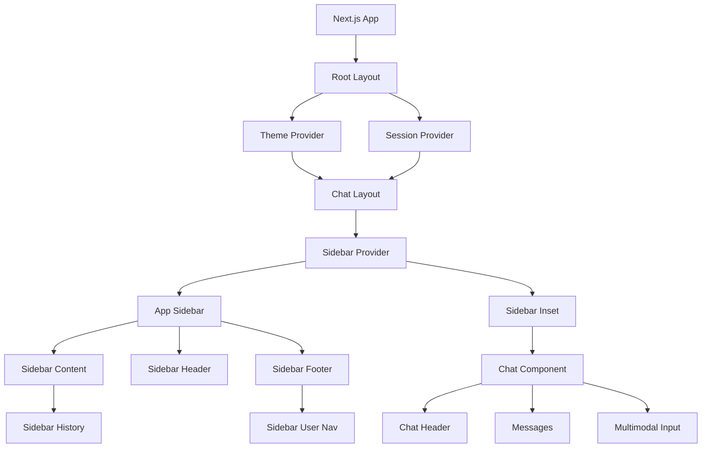

# Frontend Components and UI Architecture Overview

## 1. Component Structure

The frontend components in this chatbot application are organized using a modular, component-based design that follows Next.js App Router conventions:

```
components/
├── ui/                 # Reusable UI components (shadcn/ui)
├── artifacts/          # Artifact-related components
├── chat/               # Chat-specific components
├── app-sidebar.tsx     # Main sidebar component
├── chat-header.tsx    # Chat header component
├── chat.tsx           # Main chat component
├── theme-provider.tsx # Theme provider component
└── ...                # Other UI components
```

The application uses a hierarchical component structure:
- **Root Layout** (`app/layout.tsx`) - Contains global providers and theme configuration
- **Chat Layout** (`app/(chat)/layout.tsx`) - Contains sidebar and main content area
- **Page Components** (`app/(chat)/page.tsx`, `app/(chat)/chat/[id]/page.tsx`) - Individual pages
- **UI Components** - Reusable components in the `components/` directory

## 2. UI Framework

The application uses several modern UI frameworks and libraries:

- **Tailwind CSS**: Utility-first CSS framework for styling
- **shadcn/ui**: Component library built with Radix UI and Tailwind CSS
- **Next.js App Router**: For routing and server-side rendering
- **Framer Motion**: Animation library for React applications

The `components.json` file confirms the use of shadcn/ui with Tailwind CSS:

```json
{
  "style": "default",
  "rsc": true,
  "tsx": true,
  "tailwind": {
    "config": "tailwind.config.ts",
    "css": "app/globals.css",
    "baseColor": "zinc",
    "cssVariables": true
  }
}
```

## 3. State Management

The application uses a combination of state management approaches:

- **React State**: Local component state using `useState` and `useReducer`
- **SWR**: For data fetching and caching (used for chat history, votes, etc.)
- **Context API**: Custom contexts like `SidebarContext` for sidebar state
- **Server Actions**: For server-side state mutations
- **Custom Hooks**: Encapsulated logic for specific functionality

Key examples:
- `useChat` hook from `@ai-sdk/react` for chat state management
- `useSidebar` hook for sidebar state
- `useChatVisibility` hook for chat visibility state
- SWR for data fetching and caching

## 4. Routing

The application uses Next.js App Router with route groups:

```
app/
├── (auth)/              # Authentication pages
│   ├── login/
│   ├── register/
│   └── api/
└── (chat)/              # Main chat interface
    ├── chat/[id]/       # Individual chat pages
    ├── api/             # Chat API routes
    └── page.tsx         # Main chat page
```

Navigation is handled through:
- Next.js ` useRouter` hook for programmatic navigation
- Link components for declarative navigation
- Dynamic routes for individual chat sessions

## 5. Responsive Design

The application implements responsive design through:

- **Tailwind CSS responsive utilities**: Using classes like `md:`, `sm:`, etc.
- **Custom mobile detection**: `useIsMobile` hook that detects screen size
- **Conditional rendering**: Different UI elements shown based on screen size
- **Flexible layouts**: Using flexbox and grid for adaptive layouts

Key responsive features:
- Collapsible sidebar on mobile
- Different button layouts for mobile vs desktop
- Adaptive input areas that work on all screen sizes
- Mobile-first design approach with progressive enhancement

## 6. Theming

The application implements light/dark theming using:

- **next-themes**: A library for theme management in Next.js
- **CSS Variables**: Custom properties for theme colors in `globals.css`
- **System preference detection**: Automatically adapts to user's system preference

Theme implementation:
- `ThemeProvider` component wraps the application
- CSS variables define color schemes for both light and dark modes
- Automatic theme switching based on system preferences
- Manual theme toggle functionality in the user navigation menu

The theme colors are defined in `globals.css` with separate definitions for light and dark modes:

```css
:root {
  --background: 0 0% 100%;
  --foreground: 240 10% 3.9%;
  /* ... more light theme variables ... */
}

.dark {
  --background: 240 10% 3.9%;
  --foreground: 0 0% 98%;
  /* ... more dark theme variables ... */
}
```

## Architecture Diagram



This architecture provides a modern, scalable frontend with clear separation of concerns, responsive design, and a consistent UI experience across devices.